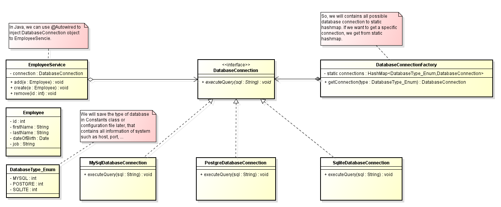

Solução do padrão Singleton
O padrão Singleton é um padrão de projeto criacional que restringe a instanciação de uma classe a um único objeto.

Em Singleton, existem duas maneiras de criar uma instância.

pré-inicializado - significa que esta instância será instanciada antes que alguém chame o método getInstance().
lazy-initialized - significa que esta instância será instanciada durante a primeira chamada do método getInstance().

Neste diagrama UML, o padrão Singleton possui as seguintes partes:

instance: SingletonA classe Singleton possui uma instância única.
getInstance(): SingletonEste é um método público que fornece a única maneira de obter uma instância única de Singleton. Este método pode ser chamado de qualquer lugar, pois é um método de classe.
Singleton()Trata-se de um construtor privado para impedir que alguém crie objetos adicionais desta classe Singleton.
Em Singleton, existem alguns métodos para implementar a lógica de negócios.

Quando usar
Quando precisamos apenas de um recurso (uma conexão de banco de dados, uma conexão de socket, …)
Para evitar múltiplas instâncias de uma classe sem estado e, assim, evitar desperdício de memória.
Por motivos comerciais.

Por que não usar?
O padrão Singleton oculta as dependências entre classes em vez de expô-las por meio de uma interface. Isso significa que precisamos ler o código de cada método para saber se uma classe está usando outra.

O Singleton viola o princípio Single Responsibility Principleda criação e do ciclo de vida, pois controla sua própria criação e ciclo de vida (usando inicialização preguiçosa, o Singleton escolhe quando é criado). Uma classe deve se concentrar apenas naquilo para o qual foi criada.

Se tivermos um Singleton que gerencia pessoas, ele deve gerenciar apenas pessoas e não como/quando elas são criadas.

Eles inerentemente causam um forte acoplamento ao código. Isso torna muito difícil simulá-los ou simulá-los para testes unitários.

Eles carregam estados durante toda a vida útil da aplicação (para singletons com estado).
Isso dificulta os testes unitários, pois podemos acabar numa situação em que os testes precisam ser ordenados, o que não faz sentido. Por definição, cada teste unitário deve ser independente dos demais.
Além disso, torna o código menos previsível.
Não devemos usar o princípio do singleton para compartilhar variáveis/dados entre diferentes objetos, pois isso gera um acoplamento muito forte.
Para substituir o uso de Singleton, podemos usar uma única instância .

Vantagens e Desvantagens
Benefícios
É fácil configurar uma instância de um aplicativo que estende a funcionalidade do singleton em tempo de execução.
Melhoria em relação à variável global.
Desvantagem
O padrão Singleton permite a criação de apenas uma instância da classe, enquanto a maioria das aplicações práticas exige a inicialização de múltiplas instâncias.
Os threads do sistema competem para acessar a única instância, degradando assim o desempenho dos aplicativos.

Frequentemente usado em excesso –> Embora geralmente não haja problemas de desempenho com singletons, se transformarmos tudo em um singleton, isso tornará nossa aplicação mais lenta.

Difícil de testar unitariamente porque o Singleton não expõe a interface e possui construtores privados, bem como variáveis ​​de membro privadas.

Se não for tomado cuidado, pode não ser seguro para uso com threads.

Às vezes é confundido com uma Factory porque, frequentemente, as pessoas começam com um singleton estático, que acaba se transformando em algo diferente. Elas começam a fazer com que o método `getInstance()` receba parâmetros. Uma regra prática é que, assim que um argumento é necessário nesse método, ele deixa de ser um singleton e passa a ser uma Factory.

